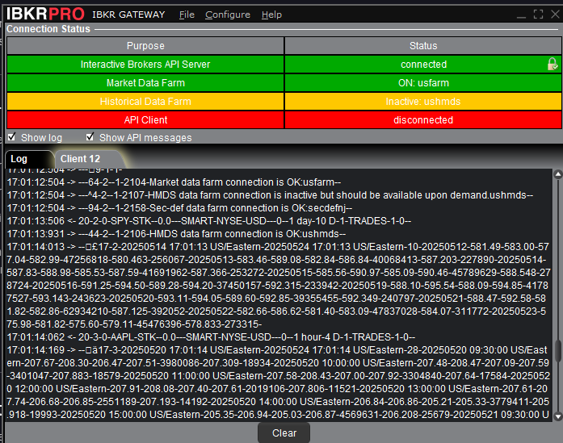

# Suite of Tools for Stock/Options Market Analysis

## For Potential Employers


I'm sharing this repository as an example of something I worked during a period of self-employment. The code and documentation are not yet as polished as they'd be in a "finished" project, though I've tried to be responsible about PyDocs.

The "secret sauce" elements of my stock/options trading strategy don't appear here, but are kept privately elsewhere. The focuses of this codebase include:
* Providing a convenient `async` API for getting stock/ETF/options data
* Being able to package this data into forms convenient for analysis and abstracted away from the peculiarities of any particular brokerage
* Being able to analyze options data for potential and ongoing trades
* Keeping an automatic record of options trades
* A software application for daytrading, called GuidedMissile
* Machine learning: as of right now, those experiments are not part of this codebase, but they will be

Options are a lot more complex than stocks, with aspects like implied volatility, delta, theta, and gamma coming into play. Woe to anyone who attempts options trading without a sufficient grasp of these things. No matter how smart you are, you're playing with fire.

This project is entirely my own creation, at least on the level of design, architecture, general coding choices, and documentation. Of course, I made some use of Google, ChatGPT, Stackoverflow, etc. to refresh my memory on certain Python packages or language features. 

## Description

This is / will be a suite of tools and code modules for interacting with [Interactive Brokers](https://www.interactivebrokers.com/), abstracting away the challenges of dealing with its often unintuitive API. Data about specific stocks/ETFs and options contracts can be collected as "clean" representations. There is also code for placing orders, which is especially helpful in daytrading applications, since the market can move so fast that entering them manually becomes a cumbersome obstacle.

It wouldn't be difficult to refactor this software to support data providers other than Interactive Brokers.

## Design Thoughts

At an earlier time, I'd created some software that pulled stock market data from Yahoo Finance, then charted it in different ways. Unfortunately, in 2025, the `yfinance` Python library became increasingly unreliable, due to Yahoo's servers throttling requests.

It seemed smarter to get data from a paid source, rather than a free one. Could I use an API provided by a brokerage I already had an account with? The answer was yes and the obvious choice was [Interactive Brokers](https://www.interactivebrokers.com/campus/ibkr-api-page/twsapi-doc/#api-introduction). For one thing, they offer a paper-trading account, so you can test out strategies "live", but in a simulated environment. For another, you can obtain historical data for specific options contracts, which you can't really do with Yahoo.

Third, back in 2020, I had already written some daytrading software that communicated with Interactive Brokers' popular trading platform, Trader Workstation. The software both gathered market data and opened/closed actual positions. Here in 2025, I decided to do something similar again, except via the lightweight "Gateway" bridge. Interactive Brokers doesn't have the most user-friendly Python API, but it's very powerful and provides access to pretty much any market data I could possibly want. Since I have a funded account with IB, I don't have to worry about them blocking access or breaking a third party library, as was a constant concern with Yahoo.

### Repackaging as pandas dataframes

It makes good sense to keep historical market data, once obtained, in `pandas` dataframes. These can be easily cached on disk (past market data is unchanging), as well as fed to machine-learning models.

## Setup

Obviously, you have to have an Interactive Brokers account to use this software.

I created a `conda` environment for this project. First step was to install the Interactive Brokers API, as detailed in their [online guide](https://www.interactivebrokers.com/campus/ibkr-quant-news/interactive-brokers-python-api-native-a-step-by-step-guide/). Once I ran `python setup.py install`, the Python packages were installed in my environment. I suppose you can use `venv`, if you prefer that.

The online docs don't mention it, but I had to run `conda install setuptools` prior to running `setup.py`.

The next step was to install the Gateway software and configure it. Note that the ports for live trading and paper trading are 4001 and 4002, respectively. These tools will also work with Trader Workstation, which is Interactive Broker's desktop trading application. The ports for that use case are 7496 and 7497, for live and paper trading.

    
`Above: Gateway`

In PyCharm, I set the interpreter type to "custom environment", then I chose my `conda` environment. 

For a command line interface, I use Anaconda's PowerShell Prompt. It works well with `git`, too. I use it like so:

```commandline
conda env list
conda activate options_2025_1
python -m scripts.place_order_example
```

## First Test

Test the setup using a program provided by Interactive Brokers themselves. Of course, the Gateway must be running and configured correctly.

```commandline
cd sample
python historical_market_data.py
```

(Make sure you've specified the right port in this script's source code.)

You should see some output like:
```
D:\CodingProjects\Python\TWS2025\sample>python historical_market_data.py
reqId: -1, errorCode: 2104, errorString: Market data farm connection is OK:usfarm, orderReject:
reqId: -1, errorCode: 2107, errorString: HMDS data farm connection is inactive but should be available upon demand.ushmds, orderReject:
reqId: -1, errorCode: 2158, errorString: Sec-def data farm connection is OK:secdefnj, orderReject:
reqId: -1, errorCode: 2106, errorString: HMDS data farm connection is OK:ushmds, orderReject:
4 Date: 20240523 09:30:00 US/Eastern, Open: 190.98, High: 191.01, Low: 189.05, Close: 189.42, Volume: 5298031, WAP: 189.938, BarCount: 24557
4 Date: 20240523 10:00:00 US/Eastern, Open: 189.42, High: 189.69, Low: 188.5, Close: 188.73, Volume: 5156525, WAP: 189.076, BarCount: 26118
4 Date: 20240523 11:00:00 US/Eastern, Open: 188.73, High: 189.71, Low: 188.68, Close: 189.69, Volume: 3032514, WAP: 189.367, BarCount: 15381
4 Date: 20240523 12:00:00 US/Eastern, Open: 189.69, High: 189.69, Low: 188.75, Close: 188.79, Volume: 2555639, WAP: 189.305, BarCount: 13657
4 Date: 20240523 13:00:00 US/Eastern, Open: 188.78, High: 188.97, Low: 187.56, Close: 187.59, Volume: 3872494, WAP: 188.318, BarCount: 19351
4 Date: 20240523 14:00:00 US/Eastern, Open: 187.59, High: 187.87, Low: 187.16, Close: 187.27, Volume: 3673161, WAP: 187.566, BarCount: 19337
4 Date: 20240523 15:00:00 US/Eastern, Open: 187.27, High: 187.83, Low: 186.62, Close: 186.91, Volume: 6469222, WAP: 187.157, BarCount: 35294
Historical Data Ended for 4. Started at 20240522 16:00:00 US/Eastern, ending at 20240523 16:00:00 US/Eastern
reqId: 4, errorCode: 366, errorString: No historical data query found for ticker id:4, orderReject:
```

To exit the program, close Gateway.

## Troubleshooting

### Error about another client accessing IB from a different IP address

You might have the IB app open on your phone (needed for authentication when you log on to a live trading account). Close it.

### No market data during competing live session

Sometimes efforts to get options Greeks will fail because of an error, `No market data during competing live session`. Try closing the Gateway and reopening it.

### Limitations on historical price data for an option

`No data of type EODChart is available for the exchange 'BEST' and the security type 'Option' and '1 d' and '1 day'`: When getting historical price data for an option, must use a smaller bar size than one-day.

