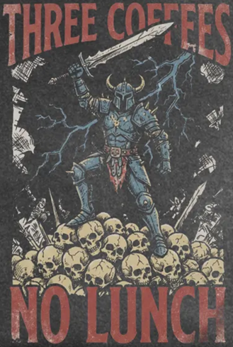

# For Potential Employers

I'm sharing this repository as an example of something I worked during a period that included self-employment, caring for an aging family member, and recovery from a debilitating tendon injury. My life was pretty challenging in 2025/2026, far more so than any corporate job, but it was still important to me to design and write code, as well as learn how to supercharge my working process by using Claude/Copilot.

All the code here is devoted to semi-automated ("semi-" for now) stock and options trading. Options trading in particular is complex and requires a fair bit of technical analysis and application of math to be successful at. I have a pretty advanced grasp of concepts such as implied volatility, delta, theta, gamma, and vega, and much of my code here has to do with strategies that take these variables into account in different ways. Options trading is something I would not recommend to anyone who doesn't have a firm understanding of the core concepts and best practices.

As a whole, this codebase is currently a work under rapid development. Some parts of it are pretty mature; others are rougher. To learn about the features provided, see the [top-level README](../README.md). I do periodic sweeps to keep the documentation up-to-date, but there might be some spots I've missed. 

I've been using this software for real, live trading, as well as a fair bit of paper trading. Other than some demo scripts, this isn't "toy" software. I take its performance and correctness seriously. I'm the sole designer and architect here. For better or worse, this is all a product of my vision and no one else's.

Much of the foundational programming work was my own. After April, 2026, I found that I no longer needed to write much code of my own. Claude Code did all the tedious stuff for me. Of course, I'm still an expert programmer and have no difficulty checking its work, which I've been doing. Claude, in my estimation, performs just as well as a trained software engineer with ten to fifteen years of professional experience, so my new role has been one of "managing" it. With the two of us as a "team", I can get work that previously would have taken me two weeks or so done in an afternoon. Still, it's worrisome to me to think of a world in which human beings are no longer incentivized to get those ten to fifteen years of coding experience for themselves, and the industry becomes overly dependent on machines and a few aging Gen-Xers/Millennials, i.e. the last two generations to master software engineering in the world preceding the rise of AI chatbots.

Part of my motivation for mastering options trading, frankly, has to do with needing a way to make an income if AI turns the software industry into too onerous of a place to work. While I can _survive_ in an environment where no one feels much sense of security, and everyone fears losing their job in the next round of layoffs, it's not really how I _want_ to live. Maybe it's possible to find a company that won't treat its workers as disposable cannon fodder in this new post-AI reality? I'd like to think so, but optimism about that has been hard to find lately.

I'm a talented, experienced, and hard worker, with first-rate written communication skills, but I will only go where I'm appreciated and treated like a human being. That's what I want more than I want to be working alone, but if such a workplace isn't available, then working alone is what I'll stick to. More than money, I care about being happy with what I do eight hours a day. Making software continues to be a lot of fun for me, including in this new world with Claude as my assistant, but corporate dysfunction isn't.

If that missive doesn't put you off from potentially interviewing me, for a Boston-area or remote job, feel free to reach out. I'm a team player and I don't need the work itself to be sexy, just for daily working life to not be actively unhealthy. I just don't need any more workplaces that feature people crying at their desks, punching holes in the wall, having emotional breakdowns on Zoom, showing up drunk to 10am meetings, or being forced to work Saturdays because the poorly-documented spaghetti code broke again.