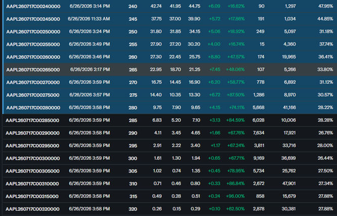
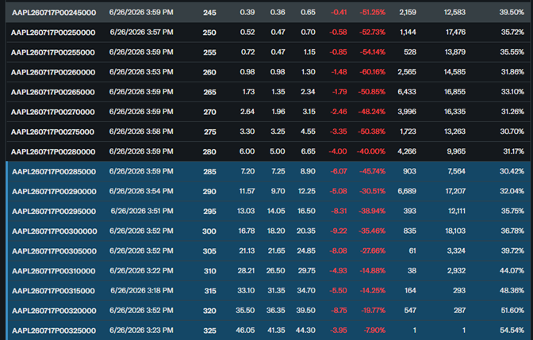
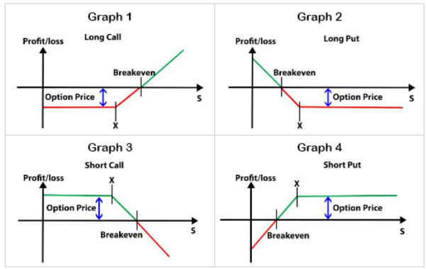
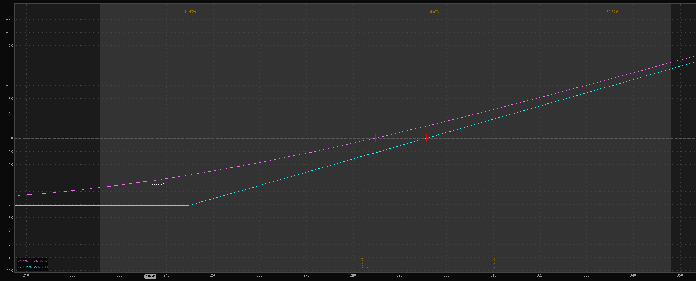
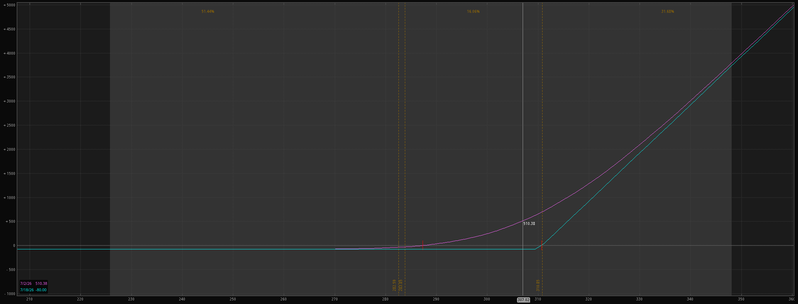
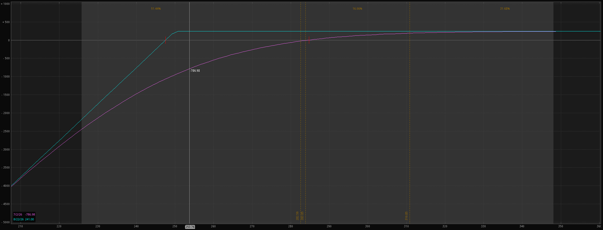
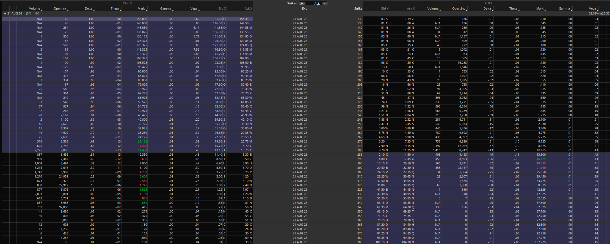
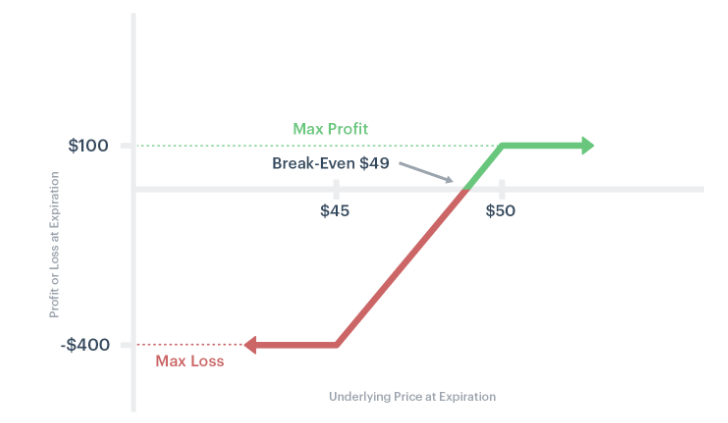
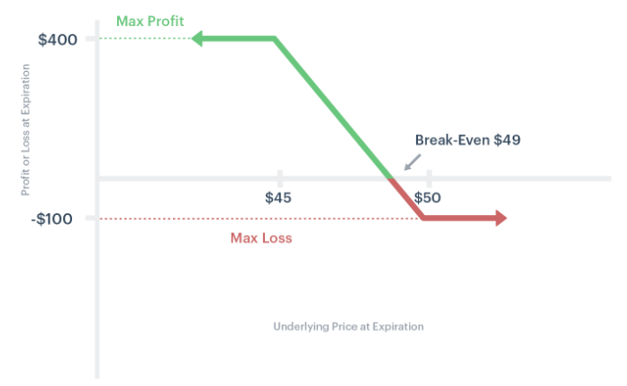

# A Primer / Reference Guide About Options

_Entirely written by me, with no help from AI._

## Basic Concepts

### What Are Options Contracts?

Options are contracts, made between a buyer and seller, which give the buyer the right to do one of the following at a time of the buyer's own choosing:
1. Sell stock at a prearranged price to the option seller. The seller is then obligated to purchase the stock at that price, regardless of what the stock's trading for on the open market at that moment.
2. Buy stock at a prearranged price from the option seller. The seller is then obligated to sell the stock to the option buyer at that price.

Typically, a single option contract concerns 100 shares of stock. The two types of options, 1) and 2) above, respectively, are named "put" options and "call" options.

> Important: "buyer" and "seller" apply to who buy/sells the option, not the underlying stock. For example, the buyer of a put option is purchasing the ability to _sell_ the underlying stock at a particular price to the option seller.

A put option can roughly be thought of an insurance policy. If the buyer owns 100 shares of XYZ and is worried that it might suffer a large drop in the near future (perhaps due to a bad earnings report, perhaps due to global events), the put option gives them the right to sell their shares of XYZ at a preset price, regardless of how far the stock's value might drop in the near future. However, as with other kinds of insurance, the buyer pays a premium for it. If the value of XYZ *doesn't* drop, then the buyer of the put option simply loses the money they spent on it. This is sort of like how the buyer of car insurance simply loses that money if no accident befalls them. The more insurance the buyer of a put option wants, the more the privilege costs them. If XYZ is currently trading at $100 per share, buying a put option whose strike is $100 will cost them more than a put option whose strike is $90. Think of buying insurance with a low deductible (which costs more) versus insurance with a high deductible.

When the owner of an option chooses to buy or sell the underlying stock, this is called exercising the option. However, this rarely happens unless the owner can better their financial position by doing so. Otherwise, they'd just be losing money.

Option contracts have several readily obvious attributes:
* Underlying: the stock or ETF to which the option applies
* Right: whether it's a put ("P") or call ("C")
* Strike: the price at which the option buyer can sell their stock (if a put) to the option seller, or buy their stock (if a call)
* Expiration: the date at which the option contract expires. As can be expected, options get more expensive the further into the future one goes with the expiration date

Call options are a little less intuitive than puts. Often enough, the buyer purchases them as "lottery tickets" on a stock whose price might shoot up in the near future. For example, if XYZ is currently trading at $100 per share, a call option that expires one month from now and has a strike price of $105 will have value to the buyer if XYZ suddenly shoots up to $110 within that time frame. The owner of the call option can then buy 100 shares of the stock at $105, immediately unload it for $110, and walk with a profit of $500, minus the cost of the call option. In fact, the owner of the call option doesn't even have to buy the stock, unless they want to; they can just sell the option and profit that way. Its value will have gone up by the same amount as the difference between 100 shares of stock at $110 and $105 (well, roughly).

### Why Does This Matter?

Options are traded as instruments in their own right, in a similar way to how stocks are traded. Prices of options contracts go up and down over time, much as stock prices do. You could buy a call option for AAPL or GOOG, and that might be comparable to owning 100 shares of AAPL or GOOG -- but with some significant caveats that this document will address later. Just because you buy an option, that doesn't mean that you have to hold it to expiration; you can sell it whenever you like, as long as there's a willing buyer out there. Similarly, if you've sold an option to someone else, and they haven't exercised it yet, you can buy it back at any time. _(Technically, you're not really buying it back, but transferring the obligation to buy/sell the underlying stock to your broker, after giving them due compensation to make up for it. The buyer, meanwhile, has no idea that the role of seller has transferred to a different party, nor would they have reason to care.)_

Major hedge funds and market makers are constantly buying and selling options to hedge their own holdings, so that does a lot to create a market for them. And if you buy a call option from your broker, they might buy shares of the underlying stock, then write (i.e. sell) a call option against it.

As for regular people who trade options, often called "retail traders", there are strategies that involve buying options, selling options, and, often enough, a combination of both.

The options market exists because options offer tremendous flexibility compared to what one can do through buying or selling stock alone. For example, you can:
* As already mentioned, "insure" existing positions against a significant market drop
* Place really leveraged bets on whether a stock will go up or down (key phrase: "really leveraged")
* Sell calls against your stock positions. This limits the profit you can make should the stock rise significantly in value, but if it doesn't, you keep the money you made selling the call.
* Get paid to buy good stocks at a discount, called a cash-secured put. If you believe GOOG will drop 5% in the near future, you can sell a put whose strike price is 5% below current market value. If GOOG doesn't drop that far, you keep the money you made selling the put. If it drops EXACTLY that far, you now own shares of GOOG, plus you keep the money from selling the put. Of course, GOOG could drop *MORE* than 5%, but GOOG will almost surely go up again. (Right?)
* Make a profit from a stock trading in a range, e.g. if XYZ stays between $95 and $105 over the next 45 days. Or: make a profit from XYZ not going below $95. Or make a profit from it not going above $105. Or make a *HUGE* profit from it being at close to $100 45 days from now and a small profit if price is a little further from $100.
* Profit from increasing market volatility (e.g. you know that the president will tweet soon) or decreasing volatility (e.g. a major war comes to an end).
* Profit in a whole bunch of other ways (or lose money in a whole bunch of other ways, if you don't know what you're doing)

### Options and Time Decay

An option has both _instrinsic_ and _extrinsic_ value. "Extrinsic" value is essentially the "premium" that the option buyer pays for their "insurance policy" or "lottery ticket". If you're worried that XYZ's stock might lose value in the near future, you can buy a put option to insure it. Later, if your worry subsides, you can sell the put back, but it will have lost some of its extrinsic value. Indeed, it might have lost a significant chunk of it, as market participants might now collectively see the danger window as having passed. As time moves towards the expiration date of the option, extrinsic value will decay down to zero. Option _sellers_ often hope to profit from this decay. The extrinsic value of an option is determined by the options market and can change over time, though the eventual decay to zero is inevitable.

Intrinsic value, when added to extrinsic value, computes to the option's actual market price. This value reflects where the stock's price currently sits in relation to the option's strike price, or how "in the money" the option is. For example, if XYZ is trading at $110 then the intrinsic value of a $105 strike call contract will be $500. Meanwhile, a call contract whose value is $110 or above will have an intrinsic value of zero.

Buyers of options contracts typically hope that gains in intrinsic value will outstrip losses in extrinsic. Sellers, meanwhile, usually hope for the reverse. 

Again, an options contract that hasn't been exercised yet can be bought or sold at any time, as long is someone is interested in being on the other end of the transaction, for a particular price. It's important, if you're going to trade options, to pick "liquid" ones, for which there's an active market and a tight spread between bid and ask prices.

### Moneyness

An option can either be in-the-money, at-the-money, or out-of-the-money. From the buyer's perspective, an option doesn't necessarily have to be in the money to be profitable, if the stock moves in the right direction early enough. However, the option does need to be ITM at the time of expiration. For sellers, it's the opposite; they usually see a loss on their position if the option moves TOWARDS being in the money, but, over time, as long as it stays out of the money, if only by a little, they eventually see profit.

A snippet from the options chain for AAPL, taken on 6/27/26. AAPL most recently traded for 283.78. The table concerns call options that expire on 7/17/26. The first column is for the name of each options contract, the second for last trade date, the third the strike price, and the fourth the last trade price for the specified contract. Don't worry about the other columns.

Options marked in blue are "in the money". Their strike price is lower than the most recent trade price for AAPL. As you can see (fourth column), these options are worth more than other options, price increasing the deeper into the money you go. Options without the blue highlighting are "out of the money". The further above AAPL's recent trade price the strikes get, the cheaper these options are. In the unlikely event that the 335 strike call were to become in-the-money before 7/17, its value would see a huge boost.

The put option chain, meanwhile, is roughly a mirror imagine of the call chain. In-the-money puts have a strike _ABOVE_ AAPL's last trade price, out-of-the-money ones strikes below it.

### Profit and Loss -- the Basics

    
`Profit-loss (payoff) diagrams`

Consider the diagrams for the long call and long put, for buying a call option and a put option, respectively. The x-axis maps to the price of the underlying stock, with `X` being the chosen strike price. These diagrams show the payout at expiration time. Notice how the underlying stock price needs to move a bit past the strike price of X for profit to occur. This reflects the deduction of the cost of the option itself. Potential loss is limited while potential gain is theoretically unlimited (key word: "theoretically" -- in a reality, an enormous gain is a statistically unlikely tail event).

The short call and short put diagrams show the potential payouts for sold call and put options. The opposite relationship to long puts and calls applies, in that potential gains are limited while potential losses are unlimited. In reality, a wisely-chosen short position has a high probability of profit.

#### Options from the Buyer's Perspective

There are two basic things a buyer of a single option can do:
1. Take a virtual long or short position in the underlying stock
2. Buy lottery tickets

To explain 1), instead of buying 100 shares of AAPL, which last traded at ~$284, you might simply buy a single deep-in-the-money call contract, with a far-off expiration date, such as December, 2026 (six months from the current date of June 27, 2026). Now, instead of spending $28,400 on AAPL, you've spent only a few thousand dollars on your contract, which moves almost as 100 shares of AAPL would. That is, if 100 shares of AAPL go up by $500, your call contract will, too. If those shares lose $500 of value, your call contract will, too. Due to the contract being deep in the money, with a distant expiration date, decay of extrinsic value won't be too much of an issue in the near future. (This will be better explained later.)

     
`Payout diagram for a December, 2026 call, strike of 245. Current AAPL trade price, as of 6/28/26, is ~284. The blue lines indicate potential payouts in December. The pink curve, however, shows an estimate of what the profit-loss curve will be a few days from now, on 7/2/26. As time passes, the pink curve will morph into the blue one, indicating the effect of time decay.`

As for 2), you could also buy call options with a $310 (out-of-the-money) strike and a relatively near expiration date, such as July 17, 2026. This will be much cheaper than following path 1) above. However, there won't be any profit unless AAPL makes a STRONG and FAST move and gets above $310 by expiration. Though this is a low probability event, you'll be paid quite handsomely if the strong, fast move does materialize.

     
`Payout diagram for a July 17, 2026 310 strike call. Again, current date is 6/28/26. As you can see, profit potential relative to risk is enormous, though the current odds of AAPL's price surpassing 310 by 7/17/26 are quite low. Again, the pink curve is for 7/2/26. If AAPL makes a strong bull move next week, it can still be quite profitable. This is one illustration of why insider trading is illegal.`

Think of puts as going in a bearish direction. You buy them expecting the underlying stock to drop. As with calls, you could either do a virtual short position, buy lottery tickets, or position yourself somewhere in between.

#### Options from the Seller's Perspective

The seller has pretty much the mirror set of choices from those I outlined for the buyer:
1. Take the opposite side of the trade from the person taking a virtual long/short position
2. Sell lottery tickets (or insurance policies)

If you sell an out-of-the-money put option for AAPL, say an August 21 250 strike put, while the stock is currently trading at $284, the odds of making a small profit from your option sale are pretty high. _HOWEVER_, if AAPL sees a huge decline in the next few weeks (from the date of writing this), you can lose quite a lot, much more than the profit you might have made.

     
`Payout diagram for sold 8/21/26 250 strike AAPL put option. The 250 strike put has a delta of .17. As long as AAPL's price is above 247.50 at expiration time, you'll have made a profit. If price drops below that, you might get assigned, i.e. be compelled to purchase 100 shares of AAPL for $250, but there are worse stocks to own. Eventually, it'll go up again, unless something crazy happens in the world. Note that rough odds of AAPL's price dropping below 250 are currently about 17% -- read further into this document to learn more about that.`

The main argument *FOR* selling options is time decay, also called theta decay. If the stock remains at the same price until expiration (which seldom happens, of course), the option becomes cheaper and cheaper to buy back. Hopefully for the seller, the decay will offset any moves made by the stock. Options sellers often practice a sophisticated technique called "delta hedging", which permits them to enjoy the fruits of time decay, while not being too affected by relatively small stock moves.

##### A Note on "Naked" Options

Your broker won't allow you to sell a put option unless you have the money to purchase 100 shares of the stock, at the strike price. Potentially, you could lose ALL that money, if the stock drops all the way to zero. However, you can't lose MORE than that.

If you sell a call option, your potential losses are theoretically unlimited, should your option become deep in the money. That's why naked option selling isn't recommended for beginners. However, there are ways to set a maximum loss on an options position. This document will explore them later.

### Concluding "The Basics"

Whether you're buying or selling options, there are always tradeoffs. Buying well-out-of-the-money puts or calls typically costs little and can lead to big returns, but the odds of those big returns are low, unless you happen to have insight into the future of a stock that the rest of the market does. Meanwhile, out-of-the-money selling puts and calls has a high potential for profit, but a small potential for a much bigger loss. Again, unless you can find some edge that mitigates losses.

If you're new to options, you probably still have a number of unanswered questions. These might include:
* How do I estimate the odds of a given options contract being in the money?
* How do I choose the best expiration date and the best strike price?
* When should I buy options? When should I sell them?
* Aren't there more sophisticated strategies than simply buying or selling an option?
* What are all these other numbers I see in option chain tables? Delta, theta, gamma, vega, implied volatility, etc.?

## More Advanced Concepts

### Odds of an Option Ending Up In the Money

     
`August 21, 2026 option chain for AAPL, viewed on 6/28/26.`

An easy way to get a rough estimate is to look at an option contract's delta value, often seen in option chains. For contracts that are close to at-the-money (i.e. strike is close to the stock's current trading price), delta is close to .50. This equates with a roughly 50/50 chance that the option will be in the money at expiration. Meanwhile, an out-of-the-money option with a delta of .20 has a roughly 20% of chance of being in the money at expiration. This option will always be substantially cheaper than the one with a delta of .50.

The delta value should only be treated as a *rough* estimate of probability, though. It will shift around as the price of the underlying stock changes. And if a stock is in a strong uptrend or downtrend, a delta of .50 doesn't really imply equal odds of going up or down from here.

A more accurate thing about delta is that it describes by how much an option contract's price will move relative to the price of the underlying stock. For a delta .50 option, it will move by 50 cents for every one dollar move made by the stock. For a delta .20 options, it'll be 20 cents. Think of the stock itself as having a delta of 1.0. Or -1.0, if you're shorting the stock.

### Multi-Leg Option Positions

#### Credit Spreads

Let's say that I want to use options to bet that XYZ, currently trading at $55, will stay above $50 over the next 45 days. I could sell a put option at $50, but that exposes me to a high potential loss. If I want to limit that loss, I could also *purchase* a put option with a strike of $45. This position is called a short put spread, or a bull credit spread. The basic idea that is that I'm taking in more money on the *short leg*, the sold $50 put, than I'm spending on the *long leg*, the purchased $45 put. Let's say that the total credit for the whole spread is $100.

The point of the long leg is to serve as insurance for my position. If price drops below $45, the most I can lose is $400 ($500 minus $100 of credit received). That is, the $500 is the difference between 100 shares at $50 and 100 shares of stock at $45.

Think about it like this: the buyer of the $50 put contract sells me 100 shares of XYZ for $5000, then my $45 put contract lets me sell them for $4500. However, my broker gets to take a convenient shortcut: they _LOAN_ me the $5000, then I give them the $4500 I made by exercising the long option (which the broker forces me to). Then I give them an additional $500, the balance of the loan. Indeed, I need to have had that $500 in my account *BEFORE* opening the put spread. This will eventually make sense if you think about it carefully.

      
`Payoff diagram for put credit spread / bull put spread. Notice the limit to maximum loss.`

At any time before anything gets exercised, I can buy back the whole spread. It will be worth the price difference between my sold contract (short leg) and purchased one (long leg). Credit spread traders often buy them back after a certain amount of profit.

#### Debit Spreads

Another possibility is a long put spread, AKA a bear debit spread. If I think that XYZ is likely to drop a lot from its current price of $55, I might *BUY* a put with a strike of $50, then *SELL* a put with a strike of $45. The credit received from the sold (short) put pays for some of the cost of the bought put, but puts a cap on potential profit for the whole spread.

      
`Payoff diagram for put debit spread / bear put spread. Notice the limit to maximum gain.`

### The Greeks

Each individual option contract has its own set of Greek values. In a multi-leg position, those of each option will combine to form a set of Greeks that apply to the whole position.

#### Delta

Delta is arguably the most important of the Greeks. It indicates by how many dollars the value of an option position (including multi-leg ones) will move for each positive one-dollar move in the price of the underlying stock. If delta is negative, then the position's value will move in the other direction.

It's important to understand that an option's delta is never fixed. As an option position moves towards being in the money, delta increases. As an option moves towards expiration (assume that underlying stock price is held fixed), its delta will slide towards 1.0 or 0, depending on whether its in or out of the money.

Some traders try to "neutralize" delta by opening positions whose separate deltas cancel each other out. This can be helpful for strategies that rely on time decay as a source of profit. As you might expect, a position with "zeroed" delta seldom stays that way for long. Delta will soon creep in a positive or negative direction.

Options that are at-the-money have a delta of .50. The deeper into the money you go on the option chain, the more delta approaches 1.0. The further out of the money you go, the more it approaches zero.

> Remember: a long stock position always has a delta of 1, a short position a delta of -1

#### Theta

Arguably the second-most important Greek. This variable indicates by how much time decay will affect a position's total value, between the current moment and one day from now. Those in long positions usually want to avoid the effects of theta decay, while those in short positions usually want to profit from it. Theta is highest in options close to the money, and diminishes as one moves up or down the option chain.

Theta grows as an option approaches expiration, the rate of decay accelerating. This is why options buyers tend to hope for quick and decisive moves in price, while options sellers prefer the opposite.

> Remember: a stock position has a theta of 0

#### Gamma

Gamma is kind of a derivative of delta. If delta indicates by how much an option price will change for a dollar move in the underlying, gamma indicates by how much _delta_ will change for that same dollar move. Gamma is highest in options closest to being at the money, and diminishes as one moves up or down the option chain.

Gamma will grow as an option approaches expiration, which means that moves in the underlying stock's price will have a more pronounced effect on the value of an options position. In many cases, those using option-selling strategies will try to exit their positions well before expiration, avoiding what's called "gamma exposure". Just as there are ways to neutralize the delta of a position, there are also ways to neutralize gamma.

> Remember: a stock position has a gamme of 0
